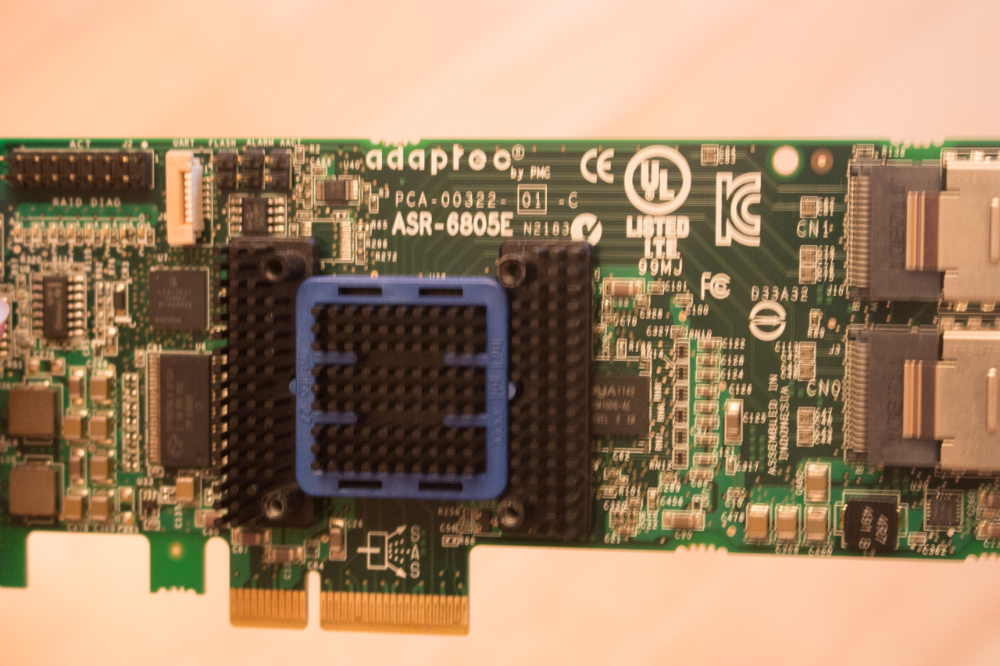
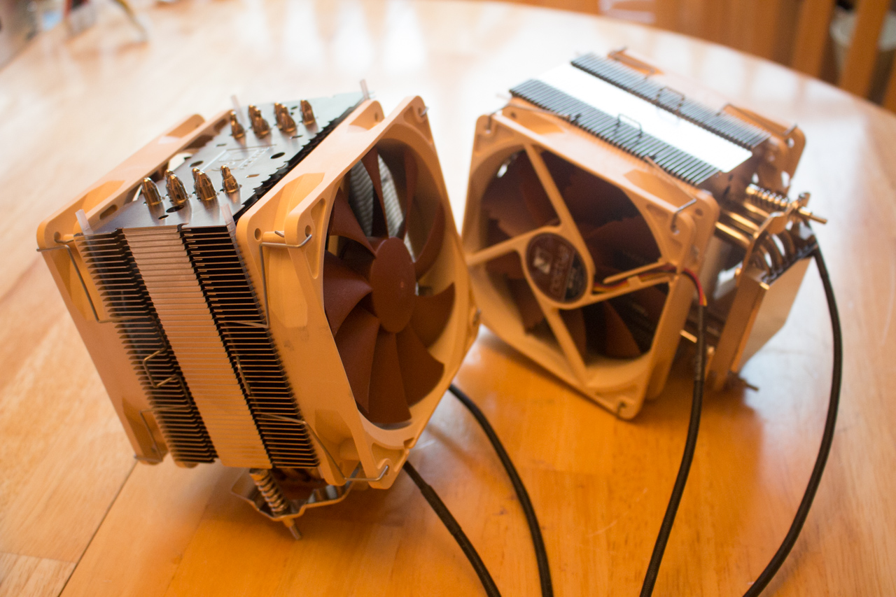

# Tech Closet Clearing House

> See add on craigslist for contact infos: http://sfbay.craigslist.org/pen/sop/5479087818.html

Time to clear out the tech closet, and there is **a lot** to get rid of. There are, at least, two full relatively powerful computers here. One of these was a server is datacenter around 5 years ago, the other I used as a over-powered media center and even as a home lab for a little while.

I've upgraded past these devices and am looking to clear out my spare room. If not sold, I'll just be taking this as one large load to the computer recycling center relatively soon. Also, the more you want to pick up, the better a deal I'll be willing to work.

Thanks for taking a look!

## Quick List

- [Adaptec 6805E (ASR-6805E)](#adaptec-6805e-asr-6805e---official)
- [Areca 1230 (ARC-1230)](#areca-1230-arc-1230---newegg)
- [Cooler Master Elite 361](#cooler-master-elite-361---amazon)
- [Zalman MS800](#zalman-ms800---amazon)
- [RM31300 3U Rackmount](#rm31300-3u-rackmount---amazon-official)
- [Z75 Pro3](#z75-pro3---official-newegg)
- [ZDPE-D12](#zdpe-d12---newegg-official)
- [ICY DOCK ToughArmor MB994SP-4S](#icy-dock-tougharmor-mb994sp-4s---amazon)
- [ICY DOCK Dual Bay 3.5" Enclosure](#icy-dock-dual-bay-35-enclosure---official)
- [EVGA SuperNOVA 1000](#evga-supernova-1000---amazon)
- [8x Fan Controller](#8x-fan-controller---newegg)
- [HDMI Extender](#hdmi-extender---amazon)
- [Creative Sound Blaster X-Fi Titanium HD](#creative-sound-blaster-x-fi-titanium-hd---newegg)
- [Noctua NC-U120DO A3 CPU Coolers](#noctua-nc-u120do-a3-cpu-coolers---newegg)

## RAID Cards

### Adaptec 6805E (ASR-6805E) - [Official](https://www.adaptec.com/en-us/support/raid/sas_raid/sas-6805e/)

8 port SATA RAID with 128mb of cache. Small, efficient, and to the point. For a home server or personal machine, more than up to the task. The bracket was swapped out with another card for a short while which had external connections, hence the cut-out -- has no effect overall.





```
$100
```

### Areca 1230 (ARC-1230) - [NewEgg](http://www.newegg.com/Product/Product.aspx?Item=N82E16816131006)

Older card, sure, but still blows most stuff out of the park. Every raid feature, strong on-board memory, and (the reason I really loved it) was the out-of-band ethernet management over http feature.

I'll even throw in enough sata cables of your picking (I have at least 3 dozen, geez...)


```
$200
```

# SPM394 - [Amazon](http://www.amazon.com/gp/product/B004JPHAF0)

Neat little device that sits in a 5.25" drive bay slot and can present 5 drives as a single, easy to setup RAID drive over a standard SATA port. No boot time lag either, which is kinda nice.


```
$100 each, or all three for $225
```

## Hard Drives

A small collection of drives, but more and negotiate a discount.

Count | Drive | Price (each) | Link
----- | ----- | ------------ | ------------------
    4 | WD Red, NASware2.0, 2.5" 1TB | $35 | [Amazon](http://www.amazon.com/Red-1TB-Hard-Disk-Drive/dp/B00EHBES1U)
    1 | Samsung 1TB 2.5" drive | $35 | [NewEgg](http://www.newegg.com/Product/Product.aspx?Item=N82E16822152291)
    2 | OCZ 32GB 2.5" SSD | $15 | [NewEgg](http://www.newegg.com/Product/Product.aspx?Item=N82E16820227510)
    1 | Corsair P128 (128gb ssd) | $30 | [NewEgg](http://www.newegg.com/Product/Product.aspx?Item=N82E16820233087)
    3 | Seagate Constellation ES 500GB  | $50 | [NewEgg](http://www.newegg.com/Product/Product.aspx?Item=N82E16822148756)

## Cases

### Cooler Master Elite 361 - [Amazon](http://www.amazon.com/Cooler-Master-RC-361-KKN1-Plastic-Computer/dp/B007VXUZYK)

Slick little case that will fit a full atx sized motherboard, but also smaller ones too. Includes a power supply!


```
$20
```

### Zalman MS800 - [Amazon](http://www.amazon.com/gp/product/B00BG5CBJG)

Wow, just...all the drive space. TEN 5.25 drive bays. Neat mid-case fan mounting solution as well.


```
$30
```

### RM31300 3U Rackmount - [Amazon](http://www.amazon.com/gp/product/B001LNVX7E), [Official](http://www.chenbro.com/en-global/products/RackmountChassis/3U_Chassis/RM31300)

I have two of these. The first was in a datacenter, but when it was shipped back they packaged it very poorly and the rails got all messed up (see pictures). However, I liked the case so much that I bought a second one to use in my "LackRack". These cases normally retail for 200+, but since I want both of them gone they're going as a package deal. One of the cases, the one that has bent mounting rails, is in near stock condition. The other went through some deconstruction (not _destruction_ though) so I could mount a regular power supply into the front.

The cases also include one 620w dual power supply that fits this chassis.


```
$200
```

## Motherboards

### Z75 Pro3 - [Official](http://www.asrock.com/mb/intel/z75%20pro3/), [NewEgg](http://www.newegg.com/Product/Product.aspx?Item=N82E16813157304)

Solid motherboard, comes with 32GB of ram (2x16gb sticks) and an Intel i3 cpu. Served both as a media center and even as a VMWare ESXi host for a time (i3 was painful for that, but it _did_ work.) Add a hard drive (see the many above) and a case and you have a nice working system.


```
$100
```

###  ZDPE-D12 - [NewEgg](http://www.newegg.com/Product/Product.aspx?Item=N82E16813131373), [Official]()

Dual Xeon board -- I'm pretty sure 2 x 4-core processors, but it hasn't been powered on in a while. Does come with 64GB (!) of ram. Excellent device for home labs or if you just want a _lot_ of processing power. The fans are, surprisingly, not too loud. 

**Includes the ASMB4-iKVM module.**


```
$250
```

## Drive Cages

### ICY DOCK ToughArmor MB994SP-4S - [Amazon](http://www.amazon.com/gp/product/B0040Z924Q)

These have been stellar for 2.5" drive swapping and storage. Caveats -- First, I removed the fans. Several died and the rest were just ecessively noisey. Since I had SSD's mostly in here, and good fans in the rear of the case, this worked out fine. Second, I probably don't have all the exactly right screws for these any more (lot of case swaps). There are 3 of these total (for up to 12 drives, see above how that matches my snazzy 12x RAID card).


```
$30 each, all three for $75
```

### ICY DOCK Dual Bay 3.5" Enclosure - [Official](http://www.icydock.com/goods.php?id=150)

Fits where you'd put a floppy disk drive, but you get 2 2.5" drives instead. Highly recommend SSDs in this enclosure for heat reasons, though.


```
$15
```

## Power Supply

### EVGA SuperNOVA 1000 - [Amazon](http://www.amazon.com/gp/product/B00EKJQM5E)

Bought this for the Platinum rating and silent operation mode. Fully modular, totally quiet, high quality power. Pretty much top-of-the-line and been used on a 40watt system for only about 1 year.


```
$150
```

## Misc

### 8x Fan Controller - [NewEgg](http://www.newegg.com/Product/Product.aspx?Item=N82E16811998089)

Not much to say -- makes fans go fast or slow at your whim. Mounts in a FDD slot.


```
$10
```

### HDMI Extender - [Amazon](http://www.amazon.com/gp/product/B007YIV1DQ)

Push your HDMI signal over ethernet. Does what it says on the tin, to be honest.


```
$100
```

### Creative Sound Blaster X-Fi Titanium HD - [NewEgg](http://www.newegg.com/Product/Product.aspx?Item=9SIA4CP1GG1881)

See link, only used this for a short time a long time ago.


```
$100
```


### Noctua NC-U120DO A3 CPU Coolers - [NewEgg](http://www.newegg.com/Product/Product.aspx?Item=N82E16835608023)

Want to never, ever hear your CPU fans? Got a gigantic case? Trying to quietly cool dual opteron system? These are amazing. I only have them installed for about 3 days, turning a 2u rackmount case into 4u of space (with the lid off). Eventually went back to 2u when I got a sound deadening enclosure.

I still have one nearly full tube of the included compound, which was enough for two processors. Everything else is still around.




```
$60 each, or both for $100
```
